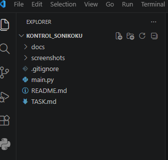
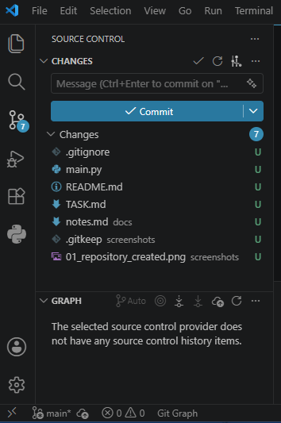
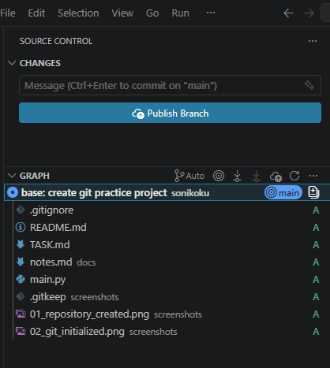
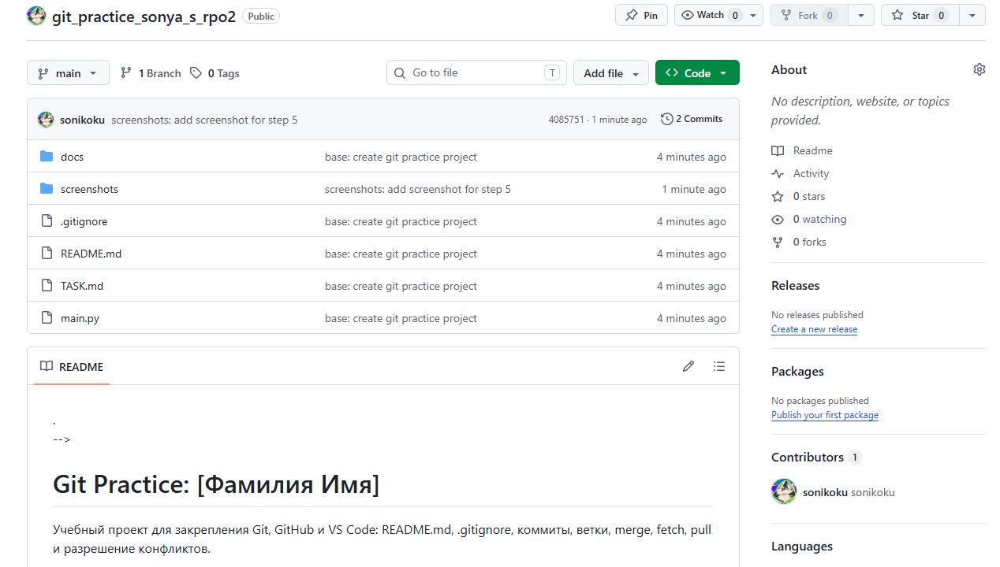
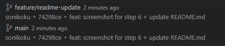
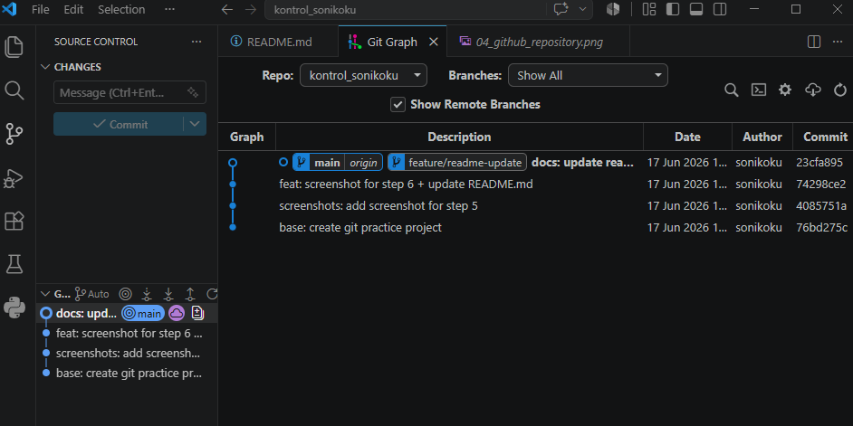
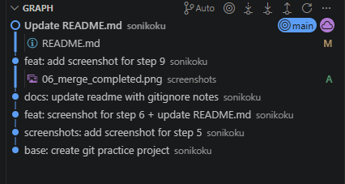
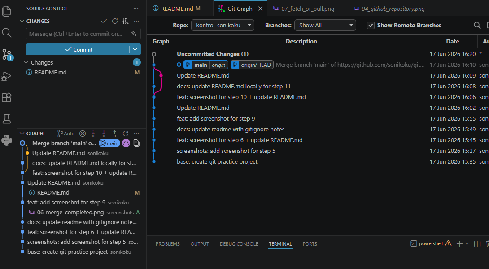

<!--
Это ШАБЛОН ОТЧЁТА. Заполните его своими данными по ходу работы.
Само задание со всеми шагами находится в файле TASK.md — его менять не нужно.
Заменяйте текст в [квадратных скобках] своими данными и удаляйте подсказки в <!-- ... -->.
-->

# Git Practice: [Фамилия Имя]

Учебный проект для закрепления Git, GitHub и VS Code: README.md, .gitignore,
коммиты, ветки, merge, fetch, pull и разрешение конфликтов.

> Инструкция к работе — в файле [TASK.md](TASK.md).

## Информация о студенте

| Поле             | Значение                                |
|------------------|-----------------------------------------|
| ФИО              | [Фамилия Имя]                           |
| Группа           | [Название группы]                       |
| Дисциплина       | Git и GitHub                            |
| Дата выполнения  | [ДД.ММ.ГГГГ]                            |
| Ссылка на GitHub | [https://github.com/username/repository]|

## Цель работы

Закрепить полный цикл работы с Git и GitHub через графический интерфейс VS Code.

## Описание выполненных этапов

<!-- Опишите своими словами, что и как вы делали. Можно дополнять пункты. -->

## Использованные Git-действия

- Clone Repository
- Initialize Repository
- Stage Changes
- Commit
- Publish Branch
- Push / Sync Changes
- Fetch
- Pull
- Create Branch / Switch Branch
- Merge
- Resolve Conflict
- Git Graph

## Таблица Git-действий и их смысла

| Действие              | Где в VS Code                     | Смысл                                                   |
|-----------------------|-----------------------------------|---------------------------------------------------------|
| Clone Repository      | Command Palette → `Git: Clone`    | Копирует репозиторий с GitHub на компьютер              |
| Initialize Repository | Source Control                    | Создаёт локальный Git-репозиторий                       |
| Stage Changes         | Source Control, кнопка `+`         | Подготавливает файлы к коммиту                          |
| Commit                | Поле `Message` + кнопка `Commit`  | Сохраняет версию проекта в истории                      |
| Publish Branch        | Source Control                    | Публикует проект/ветку на GitHub                        |
| Push / Sync Changes   | Source Control                    | Отправляет и синхронизирует коммиты с GitHub            |
| Fetch                 | Source Control → `...` → `Fetch`  | Проверяет изменения на GitHub, не меняя локальные файлы |
| Pull                  | Source Control → `...` → `Pull`   | Загружает и применяет изменения с GitHub                |
| Create / Switch Branch| Панель снизу слева, Git Graph     | Создаёт и переключает ветки                             |
| Merge                 | Git Graph / Command Palette       | Объединяет изменения одной ветки с другой               |
| Resolve Conflict      | Редактор VS Code                  | Выбор или объединение конфликтующих изменений           |
| Git Graph             | Расширение Git Graph              | Показывает историю коммитов и веток                     |

## Разница между Fetch и Pull

<!-- Опишите своими словами, что вы увидели на практике. -->

## Конфликт и его решение

<!-- Опишите, как создали и разрешили конфликт. -->

## Скриншоты выполнения работы

### 1. Созданный проект в VS Code

### 2. Инициализированный репозиторий

### 3. Первый коммит

### 4. Репозиторий на GitHub

### 5. Созданная ветка

### 6. Результат merge

### 7. Выполнение Fetch / Pull

### 8. Итоговая история в Git Graph

## Вывод

<!-- 2–4 предложения: чему научились, что было сложно, что закрепили. -->

